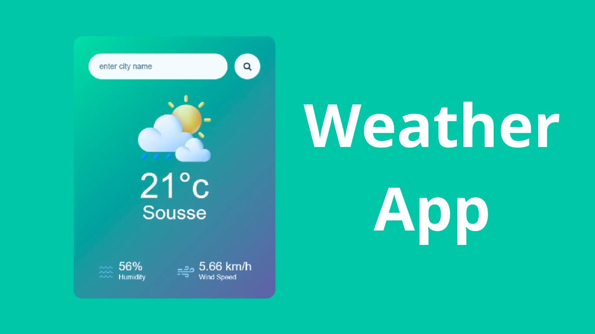

# 🌦️ Weather App Project

This is a simple **Weather App** built with **HTML**, **CSS**, and **JavaScript**.  
It fetches real-time weather data using the **OpenWeatherMap API** and displays it in a clean and responsive UI.

---

## 📸 Project Preview (Thumbnail)

---

## 🛠️ Technologies Used

- HTML5
- CSS3
- JavaScript
- OpenWeatherMap API

---

## 📚 How It Works

- User types the name of a city into the search bar.
- The app fetches weather data from OpenWeatherMap.
- It displays the city's temperature, humidity, and wind speed instantly.

---

## 🔥 Features

- Real-time API data fetching
- Search functionality with button click and 'Enter' key press

---

## 📄 License

Built with ❤️ by **Barmajli**.  
Feel free to use and modify for your own projects!

---

## 📞 Connect with Barmajli

- YouTube: [Subscribe Here](https://www.youtube.com/@Barmajli)
- GitHub: [Follow Here](https://github.com/aziz-chniti)
- Instagram: [Message Here](https://www.instagram.com/barmajli)
